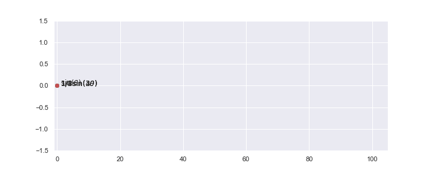
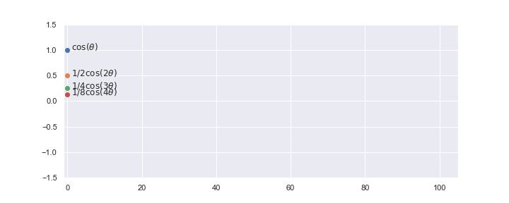

# Chapter 6

This is chapter one. Some text here...

### 6.1 Subtopics

Some text for describing the subtopics. This could include mathematical equation and figures. Some code block can be shown with direct execution. You can use it as templet for documentation and replace this text for you text.

### 6.2 Subtopics

Some text for describing the subtopics. This could include mathematical equation and figures. Some code block can be shown with direct execution. You can use it as templet for documentation and replace this text for you text.

### 6.3 Subtopics

Some text for describing the subtopics. This could include mathematical equation and figures. Some code block can be shown with direct execution. You can use it as templet for documentation and replace this text for you text.

### 6.7 Subtopics

Some text for describing the subtopics. This could include mathematical equation and figures. Some code block can be shown with direct execution. You can use it as templet for documentation and replace this text for you text.

